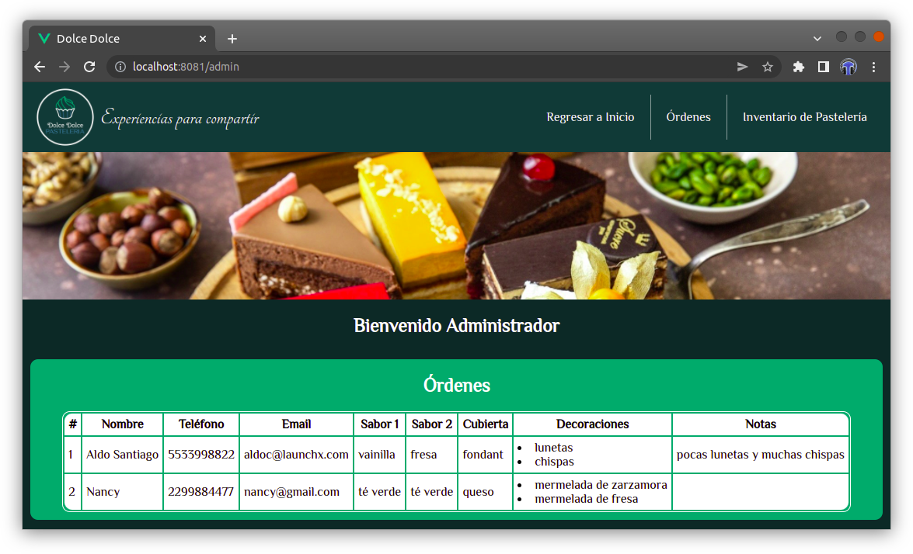
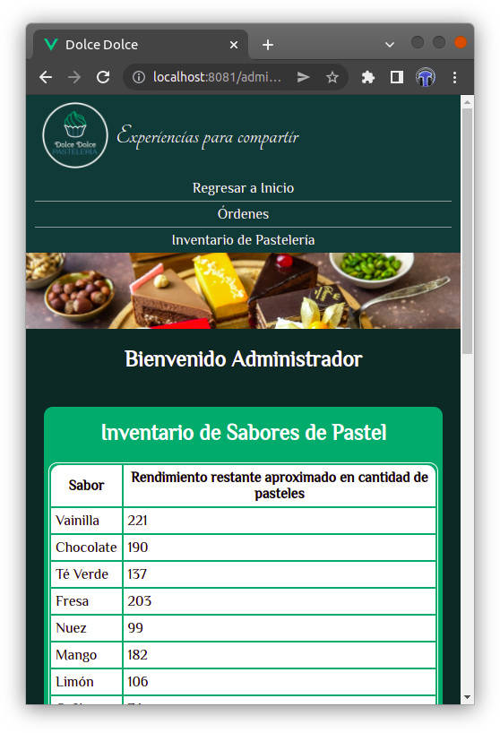
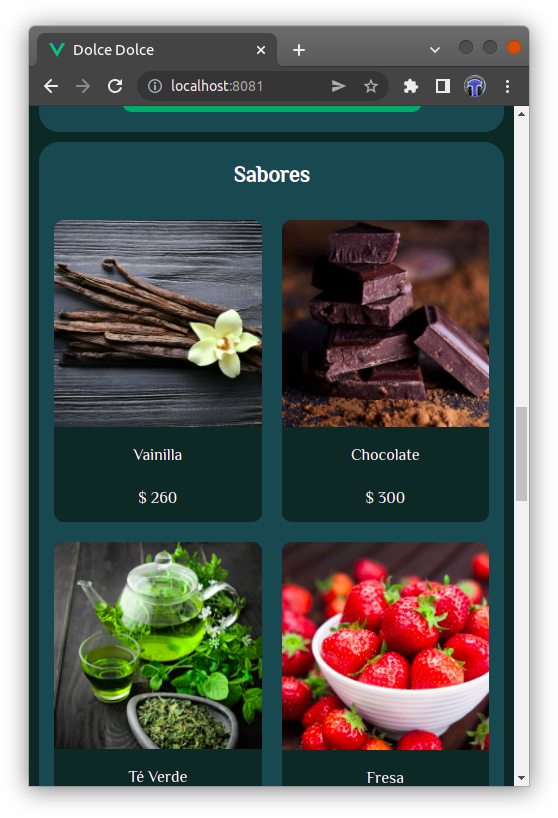

# Pastelería: Launch X - Frontend Mission - Vue.js

## Práctica del módulo 5: Vue.js Vuex
Aldo Santiago Castillo


### Práctica
- Página de cliente de pastelería POR COMPONENTES
    - Componente con información de la pastelería Dirección, Teléfono y horarios de atención
    - Componente para ver los diferentes sabores de pasteles, así como los precios de cada uno
    - Componente para ver los diferentes adornos con los que se puede decorar el pastel y los precios de cada uno
    - Componente para combinar sabores dependiendo de sus preferencias
    - Componente para combinar adornos dependiendo de sus preferencias
    - Componente de formulario debe de contener los datos de contacto del cliente que son Nombre, Teléfono, Correo Electrónico, Descripción general del pastel y la selección de sabores y adornos
- Página de pastelero POR COMPONENTES
    - Componente de información de la cantidad de sabores que le quedan para hacer los pasteles
    - Componente de información de la cantidad de adornos que le quedan para hacer los pasteles
    - Componente donde aparezcan los pedidos que se han realizado con los datos del formulario
- Uso de rutas para poder acceder a la página de cliente y de pastelero (router de Vue)
- La información de sabores, adornos, cantidades y precio debe de estar en el estado con Vuex o Vite y se debe modificar ahí para mostrarse en los componentes.

Bonus:
- Bonus si tu página es responsive y se puede ver en celulares
- Bonus de despliegue de la pastelería

Resultado:






## Project setup (From Vue CLI)
node required
```
npm install -g @vue/cli
```

### Compiles and hot-reloads for development
```
npm run serve
```

### Compiles and minifies for production
```
npm run build
```

### Customize configuration
See [Configuration Reference](https://cli.vuejs.org/config/).
